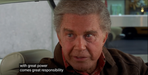
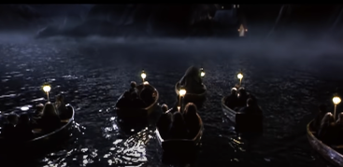

# Introduction

This is the demo page of our paper submitted to Interspeech 2025.

### 1. Examples of editing speech from movie/Youtube:

**Example 1-1: [Spider-Man](https://www.youtube.com/watch?v=guuYU74wU70&t=71s) (2002)**

***Original transcript:*** With **Great Power**, comes Great Responsibility  	

***Target transcript:*** With **more GPU**, comes Great Responsibility.

[**Original**:]

<audio style="width:320px" controls="controls">
	<source src="wavs/Great_Responsibility.wav" type="audio/wav" />
</audio>

[**Proposed VoiceNoNG:**]  

<audio style="width:320px" controls="controls">
	<source src="wavs/Great_Responsibility_gen1.wav" type="audio/wav" />
</audio>

-----------------------------------------------------------

**Example 1-2:**

***Original transcript:*** With **Great Power**, comes Great Responsibility  	

***Target transcript:*** With more **computational resources**, comes Great Responsibility.

[**Original**:]

<audio style="width:320px" controls="controls">
	<source src="wavs/Great_Responsibility.wav" type="audio/wav" />
</audio>

[**Proposed VoiceNoNG:**]  

<audio style="width:320px" controls="controls">
	<source src="wavs/Great_Responsibility_gen2.wav" type="audio/wav" />
</audio>

-----------------------------------------------------------

**Example 2: [Harry Potter and the Philosopher's Stone](https://youtu.be/ibRcSCRAyTA?t=22) (2001)**

***Original transcript:*** Dear Mr. Potter, we are pleased to inform you that you have been **accepted at** Hogwarts School of Witchcraft and Wizardry.   	

***Target transcript:*** Dear Mr. Potter, we are pleased to inform you that you have been **expelled from** Hogwarts School of Witchcraft and Wizardry.

[**Original**:]

<audio style="width:320px" controls="controls">
	<source src="wavs/Potter.wav" type="audio/wav" />
</audio>

[**Proposed VoiceNoNG:**]  

<audio style="width:320px" controls="controls">
	<source src="wavs/Potter_gen1.wav" type="audio/wav" />
</audio>
(Can keep the British Accent and even successfully generate background music!)

## RealEdit dataset

### 2. Examples of **attention errors (hallucinations)** of VoiceCraft:

**Example 1: 8173_294714_000033_000000.wav**

***Target transcript:*** promise that you will not ask me to borrow any money **from the bank for the bail** of you 
for mister van brandt she rejoined and i accept your help gratefully.

[**VoiceCraft:**]

<audio style="width:320px" controls="controls">
	<source src="wavs/8173_294714_000033_000000_seed1.wav" type="audio/wav" />
</audio>

[**Proposed VoiceNoNG:**]  

<audio style="width:320px" controls="controls">
	<source src="wavs/8173_294714_000033_000000.redit.round-0.wav" type="audio/wav" />
</audio>

-----------------------------------------------------------

**Example 2: YOU1000000101_S0000132.wav**

***Target transcript:*** yet anytime you and i question the schemes of the dogooders or dare to dig into any of their motives were denounced as being against their humanitarian goals they say we are always against things we are never for anything

[**VoiceCraft:**]

<audio style="width:320px" controls="controls">
	<source src="wavs/YOU1000000101_S0000132_seed1.wav" type="audio/wav" />
</audio>

[**Proposed VoiceNoNG:**]  

<audio style="width:320px" controls="controls">
	<source src="wavs/YOU1000000101_S0000132.redit.round-0.wav" type="audio/wav" />
</audio>

=================================================================================================================

### 3. Examples from LibriTTS

**Example 1: 116_288046_000004_000007.wav**

***Original transcript:*** And since we are doomed to **know the truth**, let us cultivate a love for it.	

***Target transcript:*** And since we are doomed to **possess and seek knowledge**, let us cultivate a love for it.

[**Original**:]

<audio style="width:320px" controls="controls">
	<source src="wavs/original_116_288046_000004_000007.wav" type="audio/wav" />
</audio>

[**Proposed VoiceNoNG:**]  

<audio style="width:320px" controls="controls">
	<source src="wavs/VoiceNoNG_116_288046_000004_000007.redit.round-0.wav" type="audio/wav" />
</audio>

[**VoiceCraft:**] 

<audio style="width:320px" controls="controls">
	<source src="wavs/VoiceCraft_116_288046_000004_000007_seed1.wav" type="audio/wav" />
</audio>

[**Voicebox:**]

<audio style="width:320px" controls="controls">
	<source src="wavs/Voicebox_116_288046_000004_000007.redit.round-0.wav" type="audio/wav" />
</audio>

[**Post-quantization:**]

<audio style="width:320px" controls="controls">
	<source src="wavs/Post-quantization_116_288046_000004_000007.redit.round-0.wav" type="audio/wav" />
</audio>

-----------------------------------------------------------

**Example 2: 2035_147960_000003_000004.wav**

***Original transcript:*** We might get **some puppies**, or owl eggs, or snake skins.	 	

***Target transcript:*** We might get **several colorful gemstones**, or owl eggs, or snake skins.

[**Original**:]

<audio style="width:320px" controls="controls">
	<source src="wavs/original_2035_147960_000003_000004.wav" type="audio/wav" />
</audio>

[**Proposed VoiceNoNG:**]  

<audio style="width:320px" controls="controls">
	<source src="wavs/VoiceNoNG_2035_147960_000003_000004.redit.round-0.wav" type="audio/wav" />
</audio>

[**VoiceCraft:**] 

<audio style="width:320px" controls="controls">
	<source src="wavs/VoiceCraft_2035_147960_000003_000004_seed1.wav" type="audio/wav" />
</audio>

[**Voicebox:**]

<audio style="width:320px" controls="controls">
	<source src="wavs/Voicebox_2035_147960_000003_000004.redit.round-0.wav" type="audio/wav" />
</audio>

[**Post-quantization:**]

<audio style="width:320px" controls="controls">
	<source src="wavs/Post-quantization_2035_147960_000003_000004.redit.round-0.wav" type="audio/wav" />
</audio>

### 4. Examples from YouTube 

**Example 1: YOU1000000005_S0000035.wav**

***Original transcript:*** and then the campaign content **i think** this one is really key to use as well.	 	

***Target transcript:*** and then the campaign content **is super detailed so** this one is really key to use as well.

[**Original**:]

<audio style="width:320px" controls="controls">
	<source src="wavs/original_YOU1000000005_S0000035.wav" type="audio/wav" />
</audio>

[**Proposed VoiceNoNG:**]  

<audio style="width:320px" controls="controls">
	<source src="wavs/VoiceNoNG_YOU1000000005_S0000035.redit.round-0.wav" type="audio/wav" />
</audio>

[**VoiceCraft:**] 

<audio style="width:320px" controls="controls">
	<source src="wavs/VoiceCraft_YOU1000000005_S0000035_seed1.wav" type="audio/wav" />
</audio>

[**Voicebox:**]

<audio style="width:320px" controls="controls">
	<source src="wavs/Voicebox_YOU1000000005_S0000035.redit.round-0.wav" type="audio/wav" />
</audio>

[**Post-quantization:**]

<audio style="width:320px" controls="controls">
	<source src="wavs/Post-quantization_YOU1000000005_S0000035.redit.round-0.wav" type="audio/wav" />
</audio>

-----------------------------------------------------------

**Example 2: YOU1000000167_S0000107.wav**

***Original transcript:*** he hadn't expected **london** to have quite so many legs.	 	

***Target transcript:*** he hadn't expected **the new furniture** to have quite so many legs.

[**Original**:]

<audio style="width:320px" controls="controls">
	<source src="wavs/original_YOU1000000167_S0000107.wav" type="audio/wav" />
</audio>

[**Proposed VoiceNoNG:**]  

<audio style="width:320px" controls="controls">
	<source src="wavs/VoiceNoNG_YOU1000000167_S0000107.redit.round-0.wav" type="audio/wav" />
</audio>

[**VoiceCraft:**] 

<audio style="width:320px" controls="controls">
	<source src="wavs/VoiceCraft_YOU1000000167_S0000107_seed1.wav" type="audio/wav" />
</audio>

[**Voicebox:**]

<audio style="width:320px" controls="controls">
	<source src="wavs/Voicebox_YOU1000000167_S0000107.redit.round-0.wav" type="audio/wav" />
</audio>

[**Post-quantization:**]

<audio style="width:320px" controls="controls">
	<source src="wavs/Post-quantization_YOU1000000167_S0000107.redit.round-0.wav" type="audio/wav" />
</audio>

### 5. Examples from Spotify 

**Example 1: show_2CJ6f4oLCccT3fsUaWAk9k-3fVgo6u94DJHpK7uP1Qb7V.wav**

***Original transcript:*** And, like comment subscribe give me **feedback** give me feedback.	 	

***Target transcript:*** And, like comment subscribe give me **your thoughts and any** feedback.

[**Original**:]

<audio style="width:320px" controls="controls">
	<source src="wavs/original_show_2CJ6f4oLCccT3fsUaWAk9k-3fVgo6u94DJHpK7uP1Qb7V.wav" type="audio/wav" />
</audio>

[**Proposed VoiceNoNG:**]  

<audio style="width:320px" controls="controls">
	<source src="wavs/VoiceNoNG_show_2CJ6f4oLCccT3fsUaWAk9k-3fVgo6u94DJHpK7uP1Qb7V.redit.round-0.wav" type="audio/wav" />
</audio>

[**VoiceCraft:**] 

<audio style="width:320px" controls="controls">
	<source src="wavs/VoiceCraft_show_2CJ6f4oLCccT3fsUaWAk9k-3fVgo6u94DJHpK7uP1Qb7V_seed1.wav" type="audio/wav" />
</audio>

[**Voicebox:**]

<audio style="width:320px" controls="controls">
	<source src="wavs/Voicebox_show_2CJ6f4oLCccT3fsUaWAk9k-3fVgo6u94DJHpK7uP1Qb7V.redit.round-0.wav" type="audio/wav" />
</audio>

[**Post-quantization:**]

<audio style="width:320px" controls="controls">
	<source src="wavs/Post-quantization_show_2CJ6f4oLCccT3fsUaWAk9k-3fVgo6u94DJHpK7uP1Qb7V.redit.round-0.wav" type="audio/wav" />
</audio>

-----------------------------------------------------------

**Example 2: show_2T8QRK60cWaPQflfo6Wuc4-4oTO10xL7hQQS2fuXBy1d7.wav**

***Original transcript:*** In the pursuit of **lightness minimal** stress ultimate fulfillment.	 	

***Target transcript:*** In the pursuit of **calm serenity an escape from** stress ultimate fulfillment.

[**Original**:]

<audio style="width:320px" controls="controls">
	<source src="wavs/original_show_2T8QRK60cWaPQflfo6Wuc4-4oTO10xL7hQQS2fuXBy1d7.wav" type="audio/wav" />
</audio>

[**Proposed VoiceNoNG:**]  

<audio style="width:320px" controls="controls">
	<source src="wavs/VoiceNoNG_show_2T8QRK60cWaPQflfo6Wuc4-4oTO10xL7hQQS2fuXBy1d7.redit.round-0.wav" type="audio/wav" />
</audio>

[**VoiceCraft:**] 

<audio style="width:320px" controls="controls">
	<source src="wavs/VoiceCraft_show_2T8QRK60cWaPQflfo6Wuc4-4oTO10xL7hQQS2fuXBy1d7_seed1.wav" type="audio/wav" />
</audio>

[**Voicebox:**]

<audio style="width:320px" controls="controls">
	<source src="wavs/Voicebox_show_2T8QRK60cWaPQflfo6Wuc4-4oTO10xL7hQQS2fuXBy1d7.redit.round-0.wav" type="audio/wav" />
</audio>

[**Post-quantization:**]

<audio style="width:320px" controls="controls">
	<source src="wavs/Post-quantization_show_2T8QRK60cWaPQflfo6Wuc4-4oTO10xL7hQQS2fuXBy1d7.redit.round-0.wav" type="audio/wav" />
</audio>

